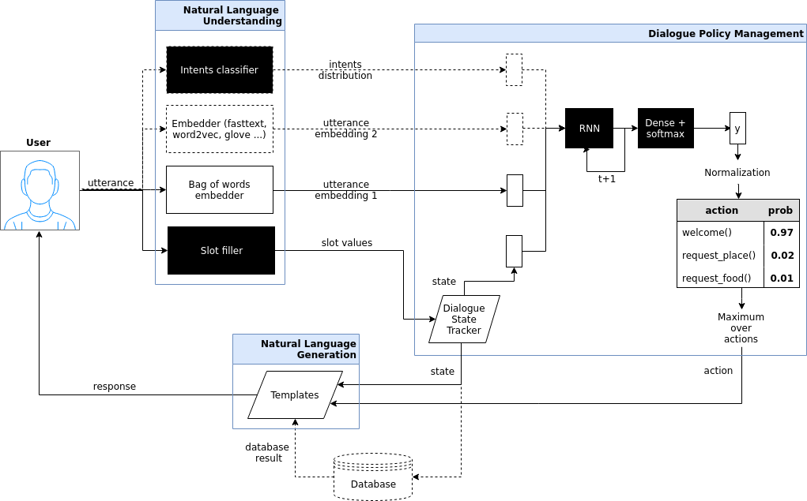

# TaskBot

+ Abstract Graph[1]
  

## Models

#### Preprocessing

+ Query Expandsion| dictionary based, similarity based, context based
+ Spelling error correction
+ segment

#### Netual Language Representation

+ Bag of Words:|tfidf

+ Network|word2vec[4], glove[3], EMlo[2]
+ Topic Model| LSI, LDA, LSA[5]

#### Netural Language Understanding

+ Named entity recognization| BiRNN-CRF[6,7], Fuzzy&Keyword Match
+ Entity Normalization|Rule, Keyword Match
+ Intent Classification| FastText[8, 9], TextCNN, Multi-Round-LSTM, Pattern Match
+ Emotion recognization

#### Dialog Management

+ Dialog state tracker
+ Action Policy| High confidence, Rule, Reinforcement Learning
+ record

#### Recovery Generation

+ Retrieval based| Text similarity rank, Metric Learning, rule based, Keyword Match
+ Knowlage Graph based| 
+ Generation Model| seq2seq

## Reference

[[1] github.com/deepmipt/DeepPavlov](https://github.com/deepmipt/DeepPavlov)

[[2] EMol:Deep contextualized word embeddings](https://arxiv.org/abs/1807.03121)

[[3] GloVe: Global Vectors for Word Representation](http://www.aclweb.org/anthology/D14-1162)

[[4] Word2vec: Distributed Representations of Words and Phrases and their Compositionality](http://papers.nips.cc/paper/5021-distributed-representations-of-words-andphrases)

[[5] Topic Model: LDA, LSI, LSA](https://blog.csdn.net/lmm6895071/article/details/74999129)

[[6]  BiLSTM-CRF: Empower Sequence Labeling with Task-Aware Neural Language Model](https://arxiv.org/abs/1709.04109)

[[7]  A BiLSTM-CRF inplement with PyTorch](https://github.com/LiyuanLucasLiu/LM-LSTM-CRF)

[[8] FastText: Compressing text classification models](https://github.com/facebookresearch/fastText)